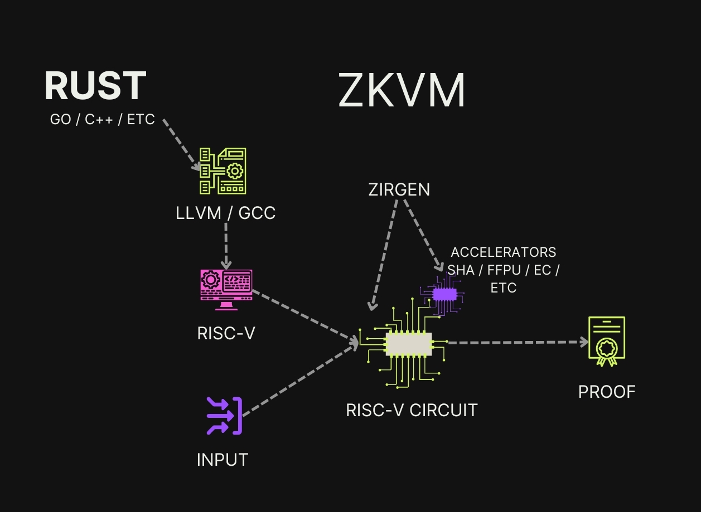

# Introduction

Welcome to the RISC Zero documentation! This site contains documentation for:

- **[The RISC Zero zkVM]**: 
A tool for building zero-knowledge software applications.
  
- **[Bonsai]**:
A proving service that allows on-chain applications to request and receive zkVM proofs.

- **[The RISC Zero Proof System]**:
The cryptographic techniques underlying the zkVM.

---
## What is RISC Zero?

RISC Zero is a startup building the RISC Zero [`zero-knowledge virtual machine`](/zkvm/) (zkVM) as a major step towards improving the security and trustworthiness of distributed applications. 
RISC Zero zkVM bridges the gap between zero-knowledge proof (ZKP) research and widely-supported programming languages such as C++ and Rust. 

ZKP technology enables programs' output to carry proof of provenance and correct execution that can be cryptographically verified by a receiver without access to the programs' inputs. 
Stripping away the jargon, this means that the output of the program can be checked for correctness by someone who cannot see its inputs. 

This verifiability allows applications to be decentralized that previously required a trusted third party, a game changer for the resilience and economics of operating the computing infrastructure we all rely on.

Foundational work on SNARKs and [STARKs](./reference-docs/about-starks.md) shows the potential of ZKP-based computations, but to date, building applications has required the adoption of new programming languages with sparse tooling support. 
_RISC Zero is removing those barriers by bringing existing languages, tools, and developer skills to ZKP development._ 
RISC Zero is achieving this by inventing a uniquely high-performance ZKP prover and then using the performance headroom to build a _zero-knowledge virtual machine (zkVM)_ that implements a standard RISC-V instruction set. 
Although difficult, emulation of RISC-V makes compatibility possible with existing mature languages and toolchains. 
In concrete terms, this looks like seamless integration between "host" application code written in a high level language running natively on the host processor (e.g. Rust on arm64 Mac) and "guest" code in the same language executing inside our zkVM (e.g. Rust on RISC-V, and specifically RV32IM). 
This is similar to the very successful pattern used in Nvidia's CUDA C++ toolchain, but with a ZKP engine in place of a GPU.

## zkVM

A zero-knowledge virtual machine (zkVM) is a virtual machine that runs trusted code and generates proofs that authenticate the zkVM output. RISC Zero's zkVM implementation, based on the RISC-V architecture, executes code and produces a [computational receipt].

Writing zkApps on RISC Zero is (almost) as straight-forward as building any other Rust project. No need to learn a custom language or any fancy math or cryptography. 

Read more about the zkVM [here](./zkvm/zkvm_overview.md) or start building with our [zkVM Quick Start](./zkvm/quickstart.md)

## Bonsai

Bonsai is a general purpose zero-knowledge proof network that allows for any chain, any protocol, and any application to take advantage of ZK proofs. It is massively parallel, programmable, and performant.

Our zero-knowledge proving network lets you integrate zero-knowledge proofs directly into any smart contracts without the need for custom circuits. This allows for ZK to be integrated directly into dApps on any EVM chain, with the potential to support any other ecosystem.

Our zkVM is the foundation of Bonsai and enables widespread language compatibility with support for provable Rust code and the potential for zero-knowledge provable code in any language that compiles to RISC-V like C++, Solidity, Go, and more. With a combination of recursive proofs, a bespoke circuit compiler, state continuations, and continuous improvements to the proving algorithm, Bonsai enables anyone to generate highly performant ZK proofs for a variety of applications. 

Read more on Bonsai [here](./bonsai/bonsai-overview.md).

## Connect with us

If you want to report a bug or contribute to our code, you can do so on [GitHub](https://github.com/risc0/risc0).

You're welcome to join [our Discord community](https://discord.gg/risczero) to discuss RISC Zero, ask questions, and see how other people use RISC Zero!

Follow us on [Twitter](https://twitter.com/risczero) and [YouTube](https://www.youtube.com/@risczero), and [sign up for our mailing list](https://fmree464va4.typeform.com/to/X3KJB85v) to get our latest announcements.

[The RISC Zero zkVM]: zkvm/zkvm_overview.md
[Bonsai]: bonsai/bonsai-overview.md
[The RISC Zero Proof System]: proof-system/proof-system.md
[computational receipt]: https://docs.rs/risc0-zkvm/0.16/risc0_zkvm/receipt/
