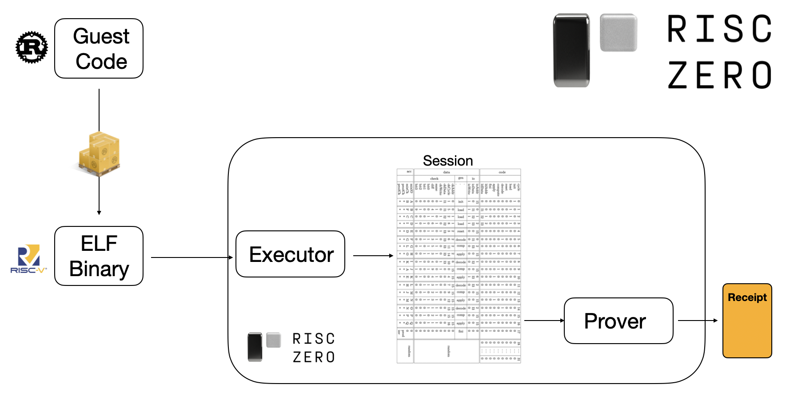

# Host Code 101
In a [zkVM application], the [host] is the machine that is running the zkVM. 
The host is an untrusted agent that sets up the zkVM environment and handles inputs/outputs during execution.
> **Note:** *If you're building for [Bonsai], you don't need to write host code.*

This page serves as an introduction to writing RISC Zero host code, to help you get started building applications for the [zkVM]. 

- For a simple example, check out the [Hello World demo], where the [guest] receives two inputs from the [host] and commits their product to the [journal]. For a slightly more complex example, see the [JSON demo].
- For a step-by-step tutorial for writing your own host code, check out our [Hello World Tutorial].
- All of the host functionality is described in the [`risc0-zkvm` Rust crate].

## The Executor & the Prover
In a zkVM application, the host is responsible for constructing and running the [Executor] and the [Prover].



In more detail, the host will: 
1. Construct an [Executor] for a [guest program], 
2. Run the [Executor] to construct a [session],
   - while the [Executor] is running, handle I/O with the [guest]
3. Run the [Prover] to generate a [receipt].
  
The [receipt] can now be passed to a third-party for verification. 
 
## A Very Simple Host
The code shown below is the `main()` function for a very simple host program. 
Aside from the absence of any I/O during execution, the host performs exactly the actions described above.
<!--- v0.17.0 -->
```
fn main() {
    let env = ExecutorEnv::builder().build().unwrap();
    let mut exec = default_executor_from_elf(env, METHOD_NAME_ELF).unwrap();
    let session = exec.run().unwrap();
    let receipt = session.prove().unwrap();
}
```

To see more complex examples, check out our [examples] folder on GitHub.

## Verifying Receipts
The functionality for [verifying receipts] is also included in the [`risc0-zkvm` Rust crate]. 

The standard workflow is for one party to generate a receipt and pass it to another party for verification, using syntax along these lines: 

```
   receipt.verify(METHOD_NAME_ID.into()).unwrap();
```

For more information on passing and verifying receipts, check out our page on [Receipts]. 
For practical demos, check out the [examples] on GitHub. 

## Happy Building!
Hopefully, this guide and the [zkVM Quick Start] page will be sufficient for you to build your first [zkVM application]! 


If you run into problems, don't be a stranger! 
You can file an issue on [these docs] or the [examples], and we're happy to answer questions on [Discord]. 

[Bonsai]: ../../bonsai/
[executor]: ../key-terminology.md#executor
[guest]: ../key-terminology.md#guest
[guest program]: ../key-terminology.md#guest-program
[session]: ../key-terminology.md#session
[receipt]: ../key-terminology.md#receipt
[proves]: ../key-terminology.md#validity-proof
[verifies]: ../key-terminology.md#verify
[host]: ../key-terminology.md#host
[`guest` module]: https://docs.rs/risc0-zkvm/0.16/risc0_zkvm/guest/index.html
[host]: ../key-terminology.md#host
[`risc0-zkvm` Rust crate]: https://docs.rs/risc0-zkvm/0.16/risc0_zkvm/index.html
[journal]: ../key-terminology.md#journal
[method]: ../key-terminology.md#method
[zkVM Quick Start]: ../quickstart.md
[zkVM Overview]: ../zkvm_overview.md
[Hello World demo]: https://github.com/risc0/risc0/tree/v0.18.0/examples/hello-world
[JSON demo]: https://github.com/risc0/risc0/blob/main/examples/json/src/main.rs
[zkVM Application]: ../
[zkVM]: ../
[examples]: https://github.com/risc0/risc0/tree/v0.18.0/examples/
[these docs]: https://github.com/risc0/website
[Hello World Tutorial]: https://github.com/risc0/risc0/tree/v0.18.0/hello-world/tutorial.md
[Discord]: https://discord.gg/risczero
[Prover]: ../key-terminology.md#prover
[verifying receipts]: https://docs.rs/risc0-zkvm/latest/risc0_zkvm/receipt/struct.Receipt.html#method.verify
[Receipts]: receipts.md
